# DevOps
A working docker-compose of a CI system with GitLab, Jenkins, and SonarQube. ( Note: you can remove Gitlab and SonarQube if you already have or you want to use .NET Full Framework project)
## Prerequisites
description: Learn about the system requirements for installing Docker Universal Control
  Plane.
keywords: docker, ucp, architecture, requirements
redirect_from:
- /ucp/installation/system-requirements/
title: UCP System requirements

Docker Universal Control Plane can be installed on-premises or on the cloud.
Before installing, be sure your infrastructure has these requirements.

### Hardware and software requirements

You can install UCP on-premises or on a cloud provider. To install UCP,
all nodes must have:

* Linux kernel version 3.10 or higher ( Ex: Ubuntun 18.04 LTS)
* Windows 10 or higher
* CS Docker Engine version 1.10 or higher. Learn about the
[operating systems supported by CS Docker Engine](/install/).
* 8.00 GB of RAM
* 30.00 GB of available disk space
* A static IP address

For highly-available installations, you also need a way to transfer files
between hosts.

### Ports used

When installing UCP on a host, make sure the following ports are open:

| Hosts              | Direction | Port                    | Purpose                                                                    |
|:-------------------|:---------:|:------------------------|:---------------------------------------------------------------------------|
| controllers, nodes |    in     | TCP 443  (configurable) | Web app and CLI client access to UCP.                                      |
| controllers, nodes |    in     | TCP 2375                | Heartbeat for nodes, to ensure they are running.                           |
| controllers        |    in     | TCP 2376 (configurable) | Swarm manager accepts requests from UCP controller.                        |
| controllers, nodes |  in, out  | UDP 4789                | Overlay networking.                                                        |
| controllers, nodes |  in, out  | TCP + UDP 7946          | Overlay networking.                                                        |
| controllers, nodes |    in     | TCP 12376               | Proxy for TLS, provides access to UCP, Swarm, and Engine.                  |
| controller         |    in     | TCP 12379               | Internal node configuration, cluster configuration, and HA.                |
| controller         |    in     | TCP 12380               | Internal node configuration, cluster configuration, and HA.                |
| controller         |    in     | TCP 12381               | Proxy for TLS, provides access to UCP.                                     |
| controller         |    in     | TCP 12382               | Manages TLS and requests from swarm manager.                               |
| controller         |    in     | TCP 12383               | Used by the authentication storage backend.                                |
| controller         |    in     | TCP 12384               | Used by authentication storage backend for replication across controllers. |
| controller         |    in     | TCP 12385               | The port where the authentication API is exposed.                          |
| controller         |    in     | TCP 12386               | Used by the authentication worker.
| nodes         |    in     | TCP 8080               | Used by Jenkins.
| nodes         |    in     | TCP 8000               | Used by Gitlab.
| nodes         |    in     | TCP 9000               | Used by SonarQube.
|

### Compatibility and maintenance lifecycle

Docker Datacenter is a software subscription that includes 3 products:

* CS Docker Engine,
* Docker Trusted Registry,
* Docker Universal Control Plane.

[Learn more about the maintenance lifecycle for these products](https://success.docker.com/article/Compatibility_Matrix).

### Where to go next

* [UCP architecture](../architecture.md)
* [Plan a production installation](plan-production-install.md)
## Instructions

### Starting the instance

Clone this repository (or just download the files). Go to the repository directory and run:

```bash
docker-compose up -d
```

These are the URLs for various services:
* GitLab - http://localhost:8000
* Jenkins - http://localhost:8080
* SonarQube - http://localhost:9000

Of course, if these ports are taken up by something else on your machine, the command will fail. In that case, either free up that port or change the port in docker-compose.yml file.

As Jenkins installation requires a secret key which is sent to the logs, use `docker logs` to get the key. Run this command:

```bash
docker logs devops_jenkins_1 | less
```

### Shutting down

Run this command:

```bash
docker-compose down
```

The data is persisted through various volumes. This means you can rerun `docker-compose up -d` to get back the system as it was before you shut it down. If you want to remove all the volumes as well, run:

```bash
docker-compose down -v
```

### Deploy a registry server
---
description: Explains how to deploy a registry
keywords: registry, on-prem, images, tags, repository, distribution, deployment
title: Deploy a registry server
---

Before you can deploy a registry, you need to install Docker on the host.
A registry is an instance of the `registry` image, and runs within Docker.

This topic provides basic information about deploying and configuring a
registry. For an exhaustive list of configuration options, see the
[configuration reference](configuration.md).

If you have an air-gapped datacenter, see
[Considerations for air-gapped registries](#considerations-for-air-gapped-registries).

## Run a local registry

Use a command like the following to start the registry container:

```bash
$ docker run -d -p 5000:5000 --restart=always --name registry registry:2
```

The registry is now ready to use.

> **Warning**: These first few examples show registry configurations that are
> only appropriate for testing. A production-ready registry must be protected by
> TLS and should ideally use an access-control mechanism. Keep reading and then
> continue to the [configuration guide](configuration.md) to deploy a
> production-ready registry.

## Copy an image from Docker Hub to your registry

You can pull an image from Docker Hub and push it to your registry. The
following example pulls the `ubuntu:16.04` image from Docker Hub and re-tags it
as `my-ubuntu`, then pushes it to the local registry. Finally, the
`ubuntu:16.04` and `my-ubuntu` images are deleted locally and the
`my-ubuntu` image is pulled from the local registry.

1.  Pull the `ubuntu:16.04` image from Docker Hub.

    ```bash
    $ docker pull ubuntu:16.04
    ```

2.  Tag the image as `localhost:5000/my-ubuntu`. This creates an additional tag
    for the existing image. When the first part of the tag is a hostname and
    port, Docker interprets this as the location of a registry, when pushing.

    ```bash
    $ docker tag ubuntu:16.04 localhost:5000/my-ubuntu
    ```

3.  Push the image to the local registry running at `localhost:5000`:

    ```bash
    $ docker push localhost:5000/my-ubuntu
    ```

4.  Remove the locally-cached `ubuntu:16.04` and `localhost:5000/my-ubuntu`
    images, so that you can test pulling the image from your registry. This
    does not remove the `localhost:5000/my-ubuntu` image from your registry.

    ```bash
    $ docker image remove ubuntu:16.04
    $ docker image remove localhost:5000/my-ubuntu
    ```

5.  Pull the `localhost:5000/my-ubuntu` image from your local registry.

    ```bash
    $ docker pull localhost:5000/my-ubuntu
    ```

## Stop a local registry

To stop the registry, use the same `docker container stop` command as with any other
container.

```bash
$ docker container stop registry
```

To remove the container, use `docker container rm`.

```bash
$ docker container stop registry && docker container rm -v registry
```

## Basic configuration

To configure the container, you can pass additional or modified options to the
`docker run` command.

The following sections provide basic guidelines for configuring your registry.
For more details, see the [registry configuration reference](configuration.md).

### Start the registry automatically

If you want to use the registry as part of your permanent infrastructure, you
should set it to restart automatically when Docker restarts or if it exits.
This example uses the `--restart always` flag to set a restart policy for the
registry.

```bash
$ docker run -d \
  -p 5000:5000 \
  --restart=always \
  --name registry \
  registry:2
```

### Customize the published port

If you are already using port 5000, or you want to run multiple local
registries to separate areas of concern, you can customize the registry's
port settings. This example runs the registry on port 5001 and also names it
`registry-test`. Remember, the first part of the `-p` value is the host port
and the second part is the port within the container. Within the container, the
registry listens on port `5000` by default.

```bash
$ docker run -d \
  -p 5001:5000 \
  --name registry-test \
  registry:2
```

If you want to change the port the registry listens on within the container, you
can use the environment variable `REGISTRY_HTTP_ADDR` to change it. This command
causes the registry to listen on port 5001 within the container:

```bash
$ docker run -d \
  -e REGISTRY_HTTP_ADDR=0.0.0.0:5001 \
  -p 5001:5001 \
  --name registry-test \
  registry:2
```


## Storage customization

### Customize the storage location

By default, your registry data is persisted as a [docker
volume](/engine/tutorials/dockervolumes.md) on the host filesystem. If you want
to store your registry contents at a specific location on your host filesystem,
such as if you have an SSD or SAN mounted into a particular directory, you might
decide to use a bind mount instead. A bind mount is more dependent on the
filesystem layout of the Docker host, but more performant in many situations.
The following example bind-mounts the host directory `/mnt/registry` into the
registry container at `/var/lib/registry/`.

```bash
$ docker run -d \
  -p 5000:5000 \
  --restart=always \
  --name registry \
  -v /mnt/registry:/var/lib/registry \
  registry:2
```

### Customize the storage back-end

By default, the registry stores its data on the local filesystem, whether you
use a bind mount or a volume. You can store the registry data in an Amazon S3
bucket, Google Cloud Platform, or on another storage back-end by using [storage
drivers](./storage-drivers/index.md). For more information, see [storage
configuration options](./configuration.md#storage).

## Run an externally-accessible registry

Running a registry only accessible on `localhost` has limited usefulness. In
order to make your registry accessible to external hosts, you must first secure
it using TLS.

This example is extended in [Run the registry as a
service](#run-the-registry-as-a-service) below.

### Get a certificate

These examples assume the following:

- Your registry URL is `https://myregistry.domain.com/`.
- Your DNS, routing, and firewall settings allow access to the registry's host
  on port 443.
- You have already obtained a certificate from a certificate authority (CA).

If you have been issued an _intermediate_ certificate instead, see
[use an intermediate certificate](#use-an-intermediate-certificate).

1.  Create a `certs` directory.

    ```bash
    $ mkdir -p certs
    ```

    Copy the `.crt` and `.key` files from the CA into the `certs` directory.
    The following steps assume that the files are named `domain.crt` and
    `domain.key`.

2.  Stop the registry if it is currently running.

    ```bash
    $ docker container stop registry
    ```

3.  Restart the registry, directing it to use the TLS certificate. This command
    bind-mounts the `certs/` directory into the container at `/certs/`, and sets
    environment variables that tell the container where to find the `domain.crt`
    and `domain.key` file. The registry runs on port 443, the default HTTPS port.

    ```bash
    $ docker run -d \
      --restart=always \
      --name registry \
      -v "$(pwd)"/certs:/certs \
      -e REGISTRY_HTTP_ADDR=0.0.0.0:443 \
      -e REGISTRY_HTTP_TLS_CERTIFICATE=/certs/domain.crt \
      -e REGISTRY_HTTP_TLS_KEY=/certs/domain.key \
      -p 443:443 \
      registry:2
    ```

4.  Docker clients can now pull from and push to your registry using its
    external address. The following commands demonstrate this:

    ```bash
    $ docker pull ubuntu:16.04
    $ docker tag ubuntu:16.04 myregistry.domain.com/my-ubuntu
    $ docker push myregistry.domain.com/my-ubuntu
    $ docker pull myregistry.domain.com/my-ubuntu
    ```

#### Use an intermediate certificate

A certificate issuer may supply you with an *intermediate* certificate. In this
case, you must concatenate your certificate with the intermediate certificate to
form a *certificate bundle*. You can do this using the `cat` command:

```bash
cat domain.crt intermediate-certificates.pem > certs/domain.crt
```

You can use the certificate bundle just as you use the `domain.crt` file in
the previous example.

### Support for Let's Encrypt

The registry supports using Let's Encrypt to automatically obtain a
browser-trusted certificate. For more information on Let's Encrypt, see
[https://letsencrypt.org/how-it-works/](https://letsencrypt.org/how-it-works/)
and the relevant section of the
[registry configuration](configuration.md#letsencrypt).

### Use an insecure registry (testing only)

It is possible to use a self-signed certificate, or to use our registry
insecurely. Unless you have set up verification for your self-signed
certificate, this is for testing only. See [run an insecure
registry](insecure.md).

## Run the registry as a service

[Swarm services](/engine/swarm/services.md) provide several advantages over
standalone containers. They use a declarative model, which means that you define
the desired state and Docker works to keep your service in that state. Services
provide automatic load balancing scaling, and the ability to control the
distribution of your service, among other advantages. Services also allow you to
store sensitive data such as TLS certificates in
[secrets](/engine/swarm/secrets.md).

The storage back-end you use determines whether you use a fully scaled service
or a service with either only a single node or a node constraint.

- If you use a distributed storage driver, such as Amazon S3, you can use a
  fully replicated service. Each worker can write to the storage back-end
  without causing write conflicts.

- If you use a local bind mount or volume, each worker node writes to its
  own storage location, which means that each registry contains a different
  data set. You can solve this problem by using a single-replica service and a
  node constraint to ensure that only a single worker is writing to the bind
  mount.

The following example starts a registry as a single-replica service, which is
accessible on any swarm node on port 80. It assumes you are using the same
TLS certificates as in the previous examples.

First, save the TLS certificate and key as secrets:

```bash
$ docker secret create domain.crt certs/domain.crt

$ docker secret create domain.key certs/domain.key
```

Next, add a label to the node where you want to run the registry.
To get the node's name, use `docker node ls`. Substitute your node's name for
`node1` below.

```bash
$ docker node update --label-add registry=true node1
```

Next, create the service, granting it access to the two secrets and constraining
it to only run on nodes with the label `registry=true`. Besides the constraint,
you are also specifying that only a single replica should run at a time. The
example bind-mounts `/mnt/registry` on the swarm node to `/var/lib/registry/`
within the container. Bind mounts rely on the pre-existing source directory,
so be sure `/mnt/registry` exists on `node1`. You might need to create it before
running the following `docker service create` command.

By default, secrets are mounted into a service at `/run/secrets/<secret-name>`.

```bash
$ docker service create \
  --name registry \
  --secret domain.crt \
  --secret domain.key \
  --constraint 'node.labels.registry==true' \
  --mount type=bind,src=/mnt/registry,dst=/var/lib/registry \
  -e REGISTRY_HTTP_ADDR=0.0.0.0:443 \
  -e REGISTRY_HTTP_TLS_CERTIFICATE=/run/secrets/domain.crt \
  -e REGISTRY_HTTP_TLS_KEY=/run/secrets/domain.key \
  --publish published=443,target=443 \
  --replicas 1 \
  registry:2
```

You can access the service on port 443 of any swarm node. Docker sends the
requests to the node which is running the service.

## Load balancing considerations

One may want to use a load balancer to distribute load, terminate TLS or
provide high availability. While a full load balancing setup is outside the
scope of this document, there are a few considerations that can make the process
smoother.

The most important aspect is that a load balanced cluster of registries must
share the same resources. For the current version of the registry, this means
the following must be the same:

  - Storage Driver
  - HTTP Secret
  - Redis Cache (if configured)

Differences in any of the above cause problems serving requests.
As an example, if you're using the filesystem driver, all registry instances
must have access to the same filesystem root, on
the same machine. For other drivers, such as S3 or Azure, they should be
accessing the same resource and share an identical configuration.
The _HTTP Secret_ coordinates uploads, so also must be the same across
instances. Configuring different redis instances works (at the time
of writing), but is not optimal if the instances are not shared, because
more requests are directed to the backend.

### Important/Required HTTP-Headers

Getting the headers correct is very important. For all responses to any
request under the "/v2/" url space, the `Docker-Distribution-API-Version`
header should be set to the value "registry/2.0", even for a 4xx response.
This header allows the docker engine to quickly resolve authentication realms
and fallback to version 1 registries, if necessary. Confirming this is setup
correctly can help avoid problems with fallback.

In the same train of thought, you must make sure you are properly sending the
`X-Forwarded-Proto`, `X-Forwarded-For`, and `Host` headers to their "client-side"
values. Failure to do so usually makes the registry issue redirects to internal
hostnames or downgrading from https to http.

A properly secured registry should return 401 when the "/v2/" endpoint is hit
without credentials. The response should include a `WWW-Authenticate`
challenge, providing guidance on how to authenticate, such as with basic auth
or a token service. If the load balancer has health checks, it is recommended
to configure it to consider a 401 response as healthy and any other as down.
This secures your registry by ensuring that configuration problems with
authentication don't accidentally expose an unprotected registry. If you're
using a less sophisticated load balancer, such as Amazon's Elastic Load
Balancer, that doesn't allow one to change the healthy response code, health
checks can be directed at "/", which always returns a `200 OK` response.

## Restricting access

Except for registries running on secure local networks, registries should always
implement access restrictions.

### Native basic auth

The simplest way to achieve access restriction is through basic authentication
(this is very similar to other web servers' basic authentication mechanism).
This example uses native basic authentication using `htpasswd` to store the
secrets.

> **Warning**:
> You **cannot** use authentication with authentication schemes that send
> credentials as clear text. You must
> [configure TLS first](deploying.md#running-a-domain-registry) for
> authentication to work.
{:.warning}

1.  Create a password file with one entry for the user `testuser`, with password
    `testpassword`:

    ```bash
    $ mkdir auth
    $ docker run \
      --entrypoint htpasswd \
      registry:2 -Bbn testuser testpassword > auth/htpasswd
    ```

2.  Stop the registry.

    ```bash
    $ docker container stop registry
    ```

3.  Start the registry with basic authentication.

    ```bash
    $ docker run -d \
      -p 5000:5000 \
      --restart=always \
      --name registry \
      -v "$(pwd)"/auth:/auth \
      -e "REGISTRY_AUTH=htpasswd" \
      -e "REGISTRY_AUTH_HTPASSWD_REALM=Registry Realm" \
      -e REGISTRY_AUTH_HTPASSWD_PATH=/auth/htpasswd \
      -v "$(pwd)"/certs:/certs \
      -e REGISTRY_HTTP_TLS_CERTIFICATE=/certs/domain.crt \
      -e REGISTRY_HTTP_TLS_KEY=/certs/domain.key \
      registry:2
      ```

4.  Try to pull an image from the registry, or push an image to the registry.
    These commands fail.

5.  Log in to the registry.

    ```bash
    $ docker login myregistrydomain.com:5000
    ```

    Provide the username and password from the first step.

    Test that you can now pull an image from the registry or push an image to
    the registry.

> **X509 errors**: X509 errors usually indicate that you are attempting to use
> a self-signed certificate without configuring the Docker daemon correctly.
> See [run an insecure registry](insecure.md).

### More advanced authentication

You may want to leverage more advanced basic auth implementations by using a
proxy in front of the registry. See the [recipes list](recipes/index.md).

The registry also supports delegated authentication which redirects users to a
specific trusted token server. This approach is more complicated to set up, and
only makes sense if you need to fully configure ACLs and need more control over
the registry's integration into your global authorization and authentication
systems. Refer to the following [background information](spec/auth/token.md) and
[configuration information here](configuration.md#auth).

This approach requires you to implement your own authentication system or
leverage a third-party implementation.

## Deploy your registry using a Compose file

If your registry invocation is advanced, it may be easier to use a Docker
compose file to deploy it, rather than relying on a specific `docker run`
invocation. Use the following example `docker-compose.yml` as a template.

```yaml
registry:
  restart: always
  image: registry:2
  ports:
    - 5000:5000
  environment:
    REGISTRY_HTTP_TLS_CERTIFICATE: /certs/domain.crt
    REGISTRY_HTTP_TLS_KEY: /certs/domain.key
    REGISTRY_AUTH: htpasswd
    REGISTRY_AUTH_HTPASSWD_PATH: /auth/htpasswd
    REGISTRY_AUTH_HTPASSWD_REALM: Registry Realm
  volumes:
    - /path/data:/var/lib/registry
    - /path/certs:/certs
    - /path/auth:/auth
```

Replace `/path` with the directory which contains the `certs/` and `auth/`
directories.
{:.warning}

Start your registry by issuing the following command in the directory containing
the `docker-compose.yml` file:

```bash
$ docker-compose up -d
```

## Considerations for air-gapped registries

You can run a registry in an environment with no internet connectivity.
However, if you rely on any images which are not local, you need to consider the
following:

- You may need to build your local registry's data volume on a connected
  host where you can run `docker pull` to get any images which are available
  remotely, and then migrate the registry's data volume to the air-gapped
  network.

- Certain images, such as the official Microsoft Windows base images, are not
  distributable. This means that when you push an image based on one of these
  images to your private registry, the non-distributable layers are **not**
  pushed, but are always fetched from their authorized location. This is fine
  for internet-connected hosts, but not in an air-gapped set-up.

  In Docker 17.06 and higher, you can configure the Docker daemon to allow
  pushing non-distributable layers to private registries, in this scenario.
  **This is only useful in air-gapped set-ups in the presence of
  non-distributable images, or in extremely bandwidth-limited situations.**
  You are responsible for ensuring that you are in compliance with the terms of
  use for non-distributable layers.

  1.  Edit the `daemon.json` file, which is located in `/etc/docker/` on Linux
      hosts and `C:\ProgramData\docker\config\daemon.json` on Windows Server.
      Assuming the file was previously empty, add the following contents:

      ```json
      {
        "allow-nondistributable-artifacts": ["myregistrydomain.com:5000"]
      }
      ```

      The value is an array of registry addresses, separated by commas.

      Save and exit the file.

  2.  Restart Docker.

  3.  Restart the registry if it does not start automatically.

  4.  When you push images to the registries in the list, their
      non-distributable layers are pushed to the registry.

      > **Warning**: Non-distributable artifacts typically have restrictions on
      > how and where they can be distributed and shared. Only use this feature
      > to push artifacts to private registries and ensure that you are in
      > compliance with any terms that cover redistributing non-distributable
      > artifacts.

### Setup Jenkins Slave node
Outline of procedure:
---------------------

Set up a virtual machine.
In our testing regime we will be using:

* Windows 10 64bit

We will be installing the following components on each windows slave:

* **Microsoft .NET and Visual Studio **
  .NET is needed to run the Jenkins service.
* **Automation Testing Tools **
  .NET is needed to run the Jenkins service.
* **Docker Desktop** we need
  to install our own copy to support running unit tests and so on.
* **GitHub for Windows.** This is the convenient windows GIT client 

* https://wiki.jenkins.io/display/JENKINS/Step+by+step+guide+to+set+up+master+and+agent+machines+on+Windows

### Configure SonarQube

-   All TFS Services, SQL Server and SonarQube, including Sonar Runner and Build Controller) hosted on a single computer.
-   Suitable for research, dogfooding and demonstration of entire end-to-end workflow on one machine.

	**>> NOTE >>** In this guide, we will demonstrate the installation and configurations using [Brian Keller's VM](http://aka.ms/ALMVMs), with all components installed on one box. 

### Medium Deployment

- TFS Services and SQL Server are hosted on a single computer and SonarQube (all components) on a separate machine.
- Suitable for evaluation in production or near-production environments.

## Recommended platform configurations

Refer to [System requirements for Team Foundation Server](https://msdn.microsoft.com/en-us/library/dd578592.aspx) and the [TFS Planning, Disaster Avoidance and Recovery, and TFS on Azure IaaS Guide](http://vsarplanningguide.codeplex.com/) for information on hardware and capacity planning recommendations for your Team Foundation Server environment.

## Running SonarQube on Hyper-V and Azure IaaS

While preparing a Virtual Machine that will host SonarQube database, portal and/or Runner workloads take into account the following guidance:

- [For production servers it is recommended to use Fixed Sized disks](https://technet.microsoft.com/en-us/magazine/ff458359.aspx) (instead of dynamic ones); you must estimate accordingly to set apart the right amount of disk space as required.
- For production servers it is recommended NOT to use dynamic assigned memory as this may decrease overall performance in a production setup; a realistic estimate should be made, monitor and adjusted accordingly.
- Follow [SQL Server best practices](http://blogs.msdn.com/b/cindygross/archive/2009/11/20/compilation-of-sql-server-tempdb-io-best-practices.aspx) while setting the SonarQube database, especially in respect of [*tempdb*](https://msdn.microsoft.com/en-us/library/ms175527.aspx) as per the usage expected by SonarQube:
	- Prefer fast disk for *tempdb* file storage.
	- Distribute storage in equally sized data files (starting at 1/2 file per physical processor and up to 8 files).
	- Monitor and size *tempdb* file storage accordingly.
	- Plan for a big size of *tempdb*; approximately 10-12 times SonarQube database size.
- Prefer usage of Windows Server 64 bits, preferably Windows Server 2012 R2.
	- Java JRE (or Java SDK) that supports Server mode and configure SonarQube to support it: editing **sonar.properties** file for sonar.web.javaOpts=**-server** and uncommenting the line by removing the \# at the start of the line.** **More details on [Installing the Web Server Tuning the Web Server](http://docs.sonarqube.org/display/SONAR/Installing#Installing-installingWebServerInstallingtheWebServer)
	- Prefer to configure Sonar Portal as Windows Service. More details on how to achieve this on [Running SonarQube as a Service on Windows](http://docs.sonarqube.org/display/SONAR/Running+SonarQube+as+a+Service+on+Windows)
- Configure rules for opening ports used by SonarQube, with the Windows firewall and Azure endpoints, if applicable.
- You may use general guidance for Performance Tuning Windows Server in your particular environment/scenario. Please refer to [Performance Tuning Guidelines for Windows Server 2012 R2](https://msdn.microsoft.com/en-us/library/windows/hardware/dn529133).
- Review and plan for [best practices for Physical Servers hosting Hyper-V roles](https://technet.microsoft.com/en-us/magazine/dd744830.aspx):
	- Avoid Overloading the Server
	- Ensure High-Speed Access to Storage
	- Install Multiple Network Interface Cards
	- Configure Antivirus Software to Bypass Hyper-V Processes and Directories
	- Avoid Storing System Files on Drives Used for Hyper-V Storage
	- Monitor Performance to Optimize and Manage Server Loading

## Setup SonarQube Server

1. **Download**
	- Download **SonarQube 5.1** from the SonarQube [downloads](http://www.sonarqube.org/downloads/).

		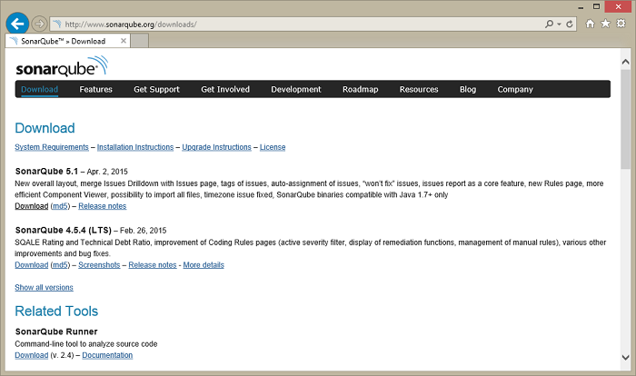
	- As mentioned in the Prerequisites section, a Java virtual machine (JVM) is required.
	- If the installed JVM meets the version requirements listed, you can skip this section. Otherwise, follow the steps below to install Java.
	- Download [Java SE Runtime Environment](http://www.oracle.com/technetwork/java) and make sure you select the one corresponding to your current operation system.

		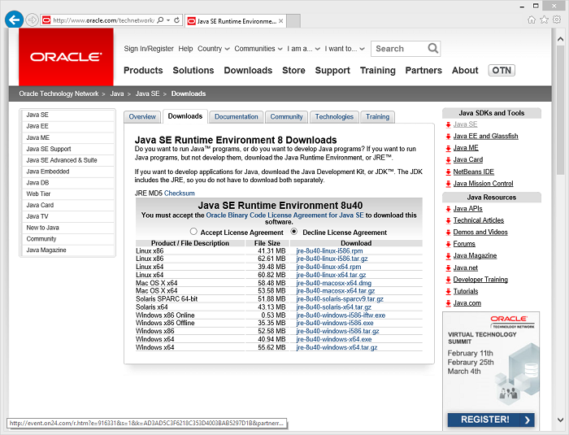
		
		**>> NOTE >>** SonarQube does not require the full Java JDK (Java SE Development Kit) to run- you only need the JRE (Java SE Runtime Environment).
2. **Install**
	- Copy **sonarqube-5.1.zip** and **jre-8u45-windows-xXX.exe** to your Team Foundation Server.
	- Install **Java SE Runtime Environment** on the destination server.

		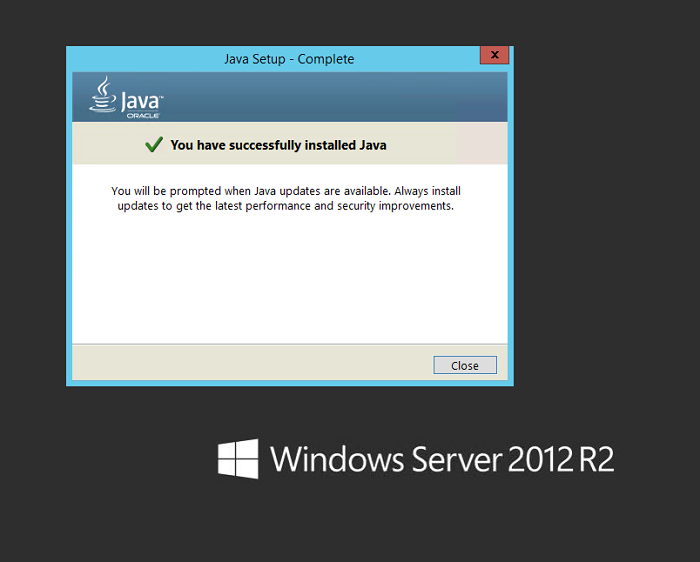
3. **Extract**

	**>> NOTE >>** Before installing and configuring SonarQube install and configure SQL Server according to the instructions in the section [Additional Configurations](additional-configurations.md).

	- Right-click on **sonarqube-5.1.zip**, select Properties and then click on the **Unblock** button
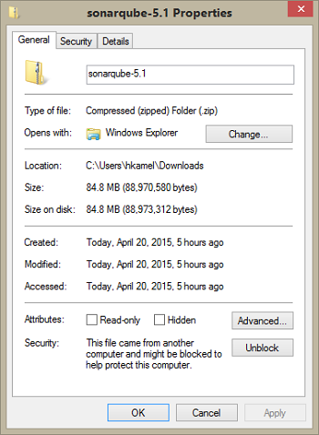
	- Unzip **SonarQube-x.x.zip** on to a drive, for example use **C:\\SonarQube\\SonarQube-5.1**.

		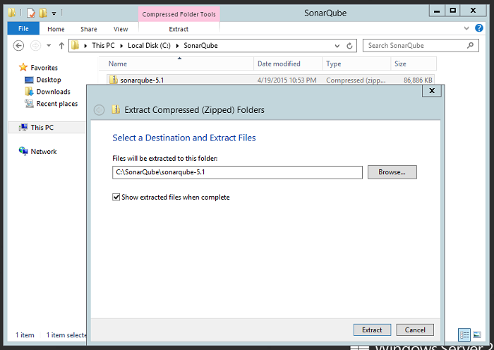
	- At this point, the installation is complete. **Yes, it is that easy**.
	- Proceed to the next section to complete the configuration of SonarQube.
4. **Configure SonarQube**

	- **>> NOTE >>** This walkthrough assumes the use of the BK VM. If, for example, you are using **SQLExpress** instead, you have to update the connection string. Example:

		```
		sonar.jdbc.url=jdbc:jtds:sqlserver://localhost/Sonar;instance=SQLEXPRESS;SelectMethod=Cursor
		```

	- Basic configuration of SonarQube consists of making a few updates to the **sonar.properties** file.
	- This file is located in the conf folder located under the SonarQube installation folder.
		Example: **C:\\SonarQube\\SonarQube-5.1\\conf**.
	- You may not want to do this step if you prefer to go with the default SonarQube port **9000**, if available.
	- In the extracted folder navigate to Conf folder, edit **sonar.properties** file to change the default web port or you may need available port. By default SonarQube uses port **9000**.
	- Make sure to assign an available port for SonarQube, you may need to use the **netstat** command to check the currently in use ports.
	- For the purpose of this walkthrough, we assume port **9000** for the FabrikamFiber demo web site.

		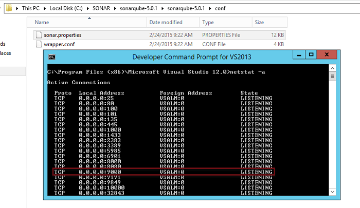
	- Search for the **\# Web Server** section.
	- Uncomment **\#sonar.web.port** and change the port number to any available port, for example **9090**
 
		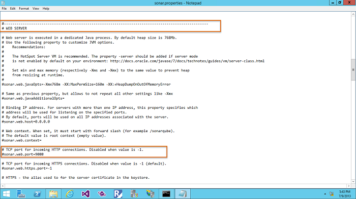

		**>>NOTE >>** Before proceeding with the below configuration steps make sure you have configured SonarQube to use SQL Server database instead of embedded database. 
	
	- Search for and locate the entry for **sonar.jdbc.username**.

		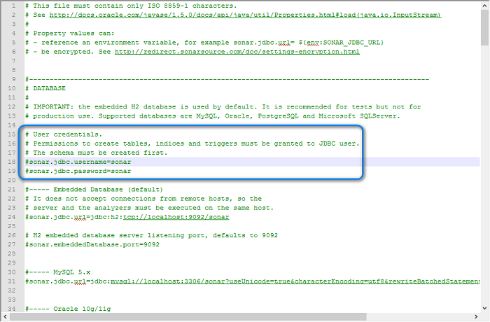
	- Uncomment (i.e. delete the leading ‘\#’) the two **sonar.jdbc** settings circled in the screenshot above and replace **sonar** in each setting with the database login name and password, respectively.

		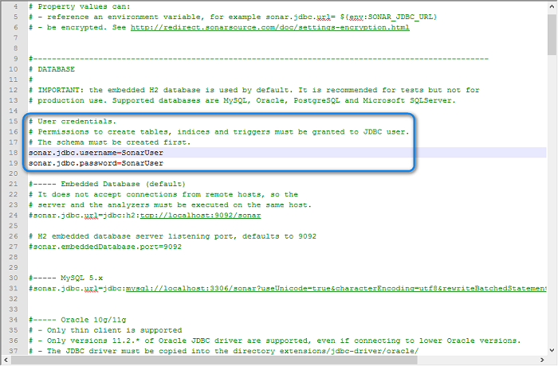
	- Search for and locate the entry for sonar.jdbc.url. There are several copies of this setting based on database type. Make sure you select the entry for Microsoft SQL Server.

		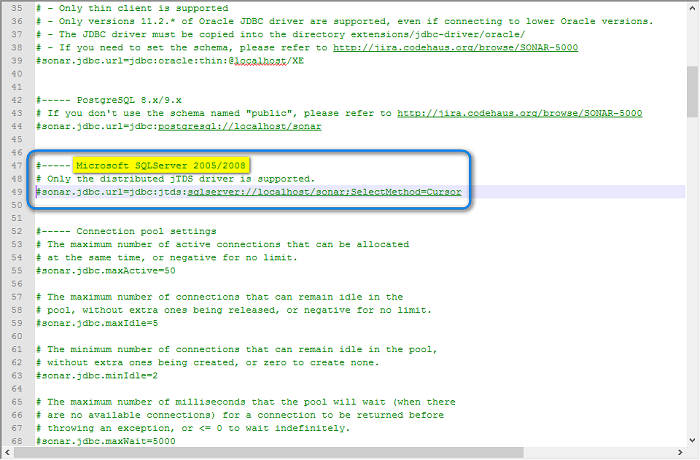
	- Uncomment (i.e. delete the leading ‘\#’) the sonar.jdbc.url setting circled in the screenshot above and replace the connection string to match the server\\instance and database name for your machine. Example: **sqlserver://.\\SQLExpress/Sonar;SelectMethod=Cursor**

		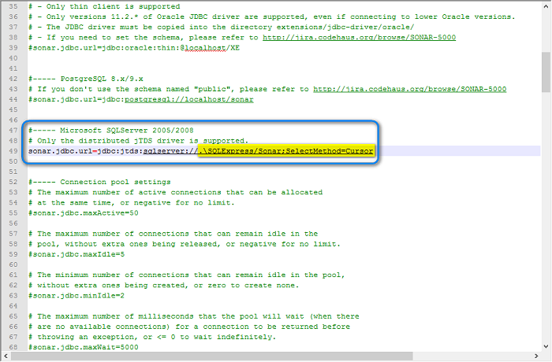
		
		**>> NOTE >>** The jdbc driver installed with SonarQube requires the SQL Server Browser to be running. Check that it is running using the Services Console.

	- Save and close the file.

5. <a name="installLatestPluginAnchor"></a>**Download and install latest SonarQube C# plugin**

	- Download the latest sonar-csharp-plugin-X.Y.jar. At the time of writing, all versions of the C\# plugin are available from the [C\# Plugin](http://redirect.sonarsource.com/plugins/csharp.html) page, on the SonarQube site.
	- Use version 4.1 or higher of the plugin.
	- Locate the directory into which the SonarQube was installed e.g. **C:\\SonarQube\\SonarQube-5.1\\**. This directory will have an **extensions\\plugins\\** subdirectory.
	- Copy **sonar-csharp-plugin-X.Y.jar** to this directory from the downloaded package above.
	- Right-click the sonar sonar-csharp-plugin-X.Y.jar and select **properties**.
	- Click the **Unblock** button to ensure the file is unblocked.

6. **Run**

	- Open Command Prompt and change directory (`cd`) to the extracted folder.

		Example:
		```
		cd C:\SonarQube\SonarQube-5.1\bin\windows-x86-64
		```

	- **>> NOTE >>** You need to run the file corresponding to your operating system.
	- Run **StartSonar.bat**
	- **>> NOTE>>** If you are prompted with a Windows Security Alert asking for network access, click on the Allow access button

		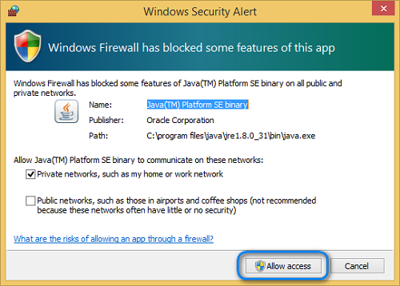
		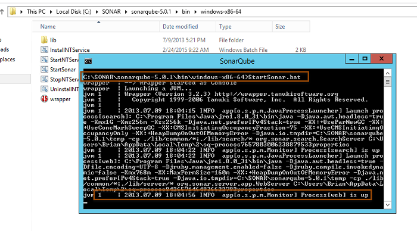 
	- Browse SonarQube web portal using [http://YOUR\_SERVER\_NAME:SONAR\_PORT](http://YOUR_SERVER_NAME:9090). Example: [**http://vsalm:9090**](http://vsalm:9090)

		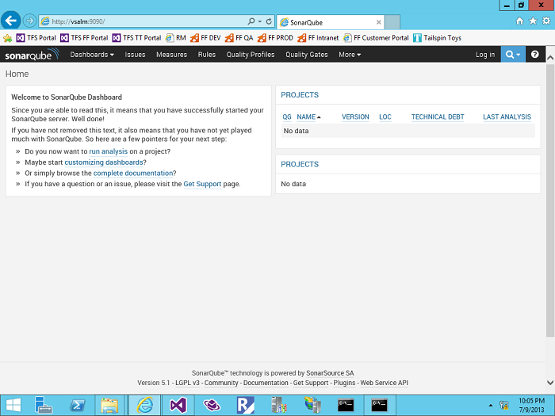
	- You should see the default SonarQube web page as shown above. If not, re-validate settings as shown in the previous sections.
	- If the web server does not start, consult the logs in **C:\\SonarQube\\SonarQube-5.1\\logs** to determine possible issues.
7. **Verify the installed SonarQube C# plugin version**
	- Login to SonarQube using admin credentials.
		- If this is the first time you are using SonarQube, the default admin credentials are:
	
		    `- Username: admin`

			`- Password: admin`

	- If you log in using the default credentials, it is recommended that you change the password.
	- Verify that the C\# X.Y plugin has been correctly deployed, Navigate to **Settings \>System \> Update Center**.

		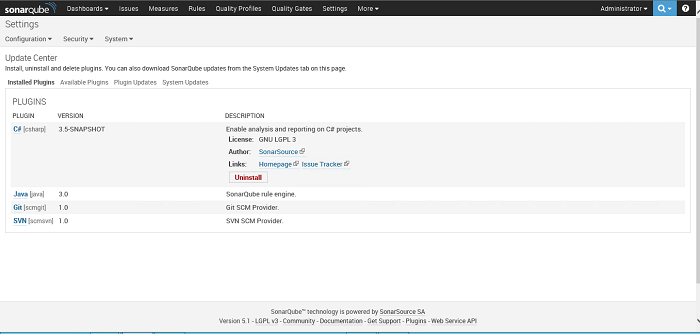
		
	**>> NOTE >>** The screenshot above is based version 3.5. You should see version 4.1 or later.

	**>> NOTE >>** Please refer to section **[Additional Configurations](additional-configurations.md)** for more details on how-to configure additional SonarQube configurations that are required for enterprise level deployment.

## Setup of the *SonarQube Scanner for MSBuild* on the Build Agent Machine

- You should install it on any machine that will launch SonarQube analysis (example: development machine and build agent).
- In case of installing *SonarQube Scanner for MSBuild* on a development machine or build agent, you need to make sure that Java SE Runtime Environment installed on that machine.
- Java SE Runtime Environment installation is not required if Visual Studio 2015 with Android tooling/Cross platform tools are installed since JDK is being installed part of Visual Studio installation.

1. **Extract**
	- Download the latest *SonarQube Scanner for MSBuild* from the SonarQube [downloads](http://www.sonarqube.org/downloads/).
	- Right-click on the downloaded .zip file and click on the **Unblock** button.

		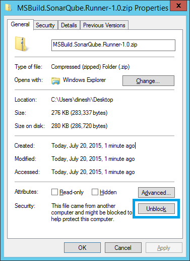
	- Unzip **MSBuild.SonarQube.Runner-[version]** on to a drive.
	Example: **C:\\SonarQube\\bin**

2. **Configure**
	- Edit **C:\\SonarQube\\bin\\SonarQube.Analysis.xml** by specifying the following parameters to run against the SonarQube Server we set up earlier.
	- If you are running SonarQube 5.1.x or less, uncomment and set the following properties:
		- `sonar.jdbc.url`
		- `sonar.jdbc.username`
		- `sonar.jdbc.password`

			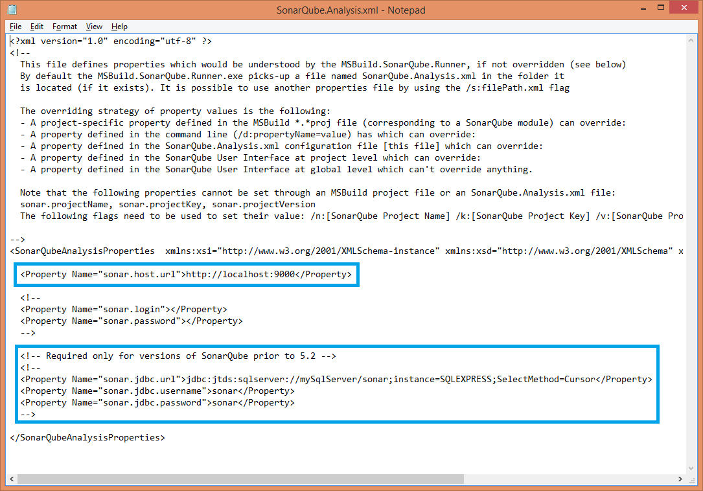

3. **OPTIONAL - Update the `%PATH%` environment variable**

	- Add the directory containing *MSBuild.SonarQube.Runner.exe* to the `%PATH%` if you intend to use it from the command line:

		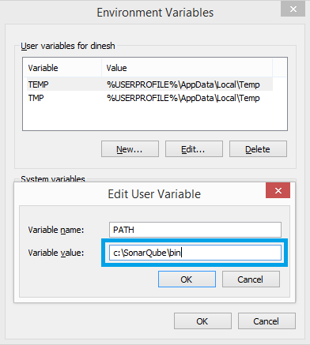

### Settings File Permissions

- Storing passwords in clear text in unsecured settings files is **not** recommended.
- Restrict access to the **C:\\SonarQube\\bin\\SonarQube.Analysis.xml** file by setting appropriate file permissions.
